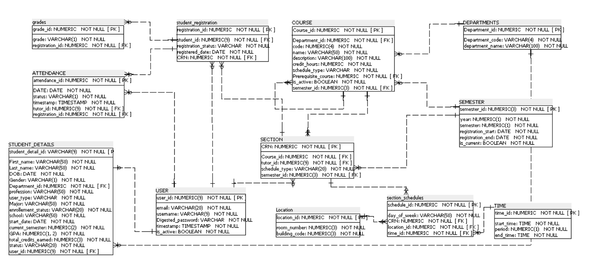

### Classy: A Django Student Self-Service Banner

A full-featured Student Information System (SIS) built with Django, mimicking the core functionality of real-world self-service Banner. Classy allows students to manage their academic journey.

You can view our app here: [CLASSY!](https://classy-fa28de6ea0ef.herokuapp.com/)

### _Members_
Created by the best SSB team:
- Alya Alaali
- Yousif Radhi
- Feras Darwish

## _Description_

Classy is a Self-Service Banner (SSB), a student information system built for academic administration. It serves as a central hub for students, providing them with the tools to manage their academic journey.
Students can securely log in to view their personal information, register for courses, plan their semesters, and access important reports!

## _Key App Features_
***1. Student Dashboard***
- Apply for Admission - Submit an application and get your student login details by email.
- Student Profile - See your personal and academic information.
- Plan Ahead - Build and visualize potential class schedules before registering.
- Registeration - Search for classes and officially register for your semester.
- View Your Weekly Schedule - See a clear timetable of all your classes for the week.
- Attendance - View attendance reports for your courses.
- See Your Enrolled Classes - A simple list of all classes you are currently taking.
- Academic Transcript - View your official grades and academic history.

***2. Faculty Dashboard***
- Student Lookup - Search for and view student profiles and records.
- Mark Attendance - Take and submit attendance for your classes.
- Grade Students - Enter and submit grades for your courses.
- View My Courses - See a list of all classes, location and timings assigned to you to teach.

***3. Administrative Dashboard***
- Create Users - Add new students, faculty, and staff to the system.
- Admit Students - Review applications and officially admit students.
- Manage Students - Edit and update user profiles and information.
- Plan Registration - Build and manage course schedules and semesters.
- Manage Sections - Create new class sections and assign faculty to sections.
- Set Timings and locations - Define class times, durations and locations for the schedule.

## _Technologies used_
- Backend: Django, Python
- Frontend: Django Templates (HTML), Vanilla CSS
- Database: PostgreSQL
- Deployment: Heroku

## _Project Plan_

1. **Entity Relationship Diagram**
###### A visual representation of our database schema and the relationships between models (Users, Students, Courses, Registrations, Attendance, Plans, etc.).

 

2. **Design and Wireframes**
###### Our initial designs were created in Figma. View Wireframes: [Classy Figma File](https://www.figma.com/design/TWKe9bsGHfUYdSXq6yz6Rt/SSB?node-id=0-1&t=REz6iXyguLgBiaI6-1)

3. **Project Management**

###### We used Notion to organize tasks and track progress throughout the project: [Notion Link](https://www.notion.so/SSB-clone-245c7cb3abbf80409236cdac969b9734?source=copy_link)

---

### _Future Enhancement_

1. GPA calculator: Allow students to calculate their GPA automatically in order to predict future academic standing
2. payment gateway:  Allow students to pay tuition and fees directly through the portal (e.g., Stripe). 
3. registration override: Allow admins to grant permission for students to join full or restricted courses.
4. rate your professor:  A feature for students to leave reviews and ratings for their professors.
